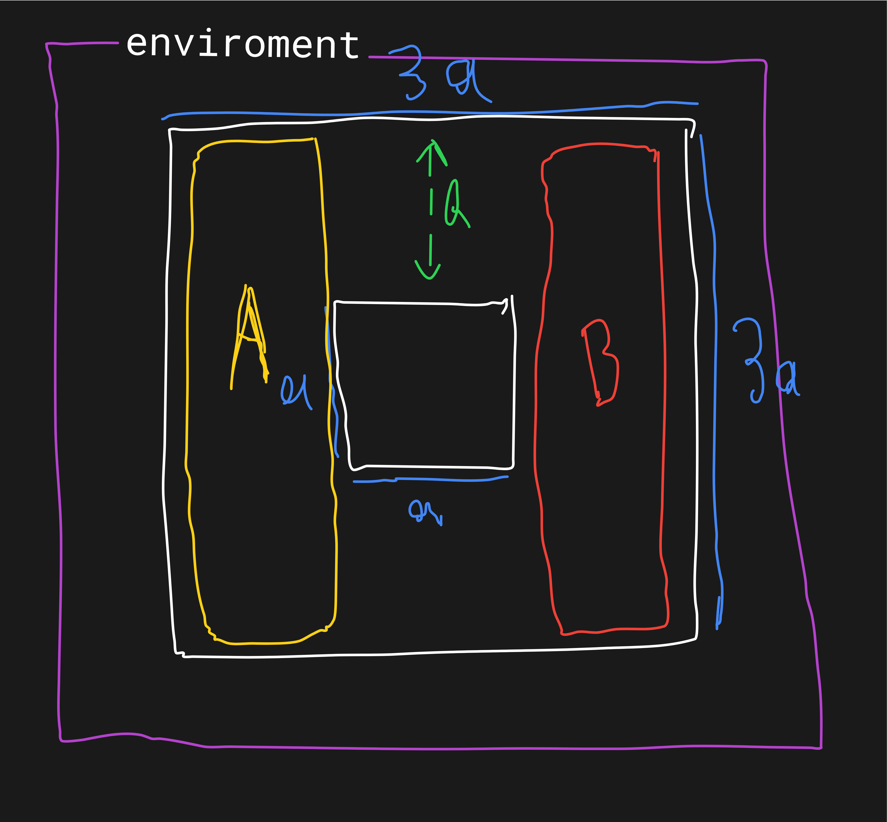
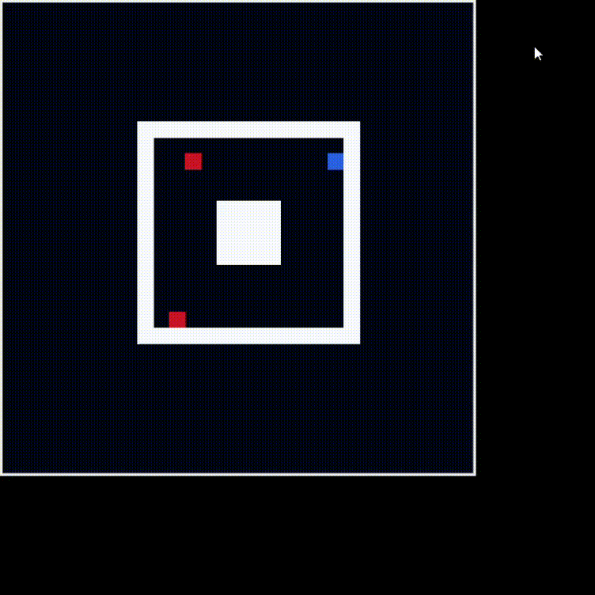

# multi-agent reinfocement learning
this is a very simple multi-agent reinforcement learning task.

## info
there are 2 group:
- group A: consists of 2 agent, thier goal is to catch the agent in group B
- group B: consists of 1 agent, its goal is to stay alive until the time ends

### enviroment
env is just a grid 3ax3a where a is the length of grid. there is a center block (just for a bit complexity)

the rules are:
- group A wins if one of the members reaches to one of the member in B
- group B wins if non of the members couldn't reach the B in specified time

### results
well. agents in group A perform roughly well (although there could be some improments). but agent in B failed to survive (well, it is probably because after the agents in A learned to reaching to B is goal and learned to work with each other, it is almost impossible to get survied then)

here is one of cases where agents in A work each other to catch B

### about files

- agent -> agent with deep q learning method
- game_engine -> the game without graphics
- game -> game with graphics
- main -> for training
- multi_agent -> a class implementation that wrappes agent.py Agent for doing stuffes in one function
- state_setting -> used to extract states from env
- testing -> test agents againest each other
- testinghuman -> play agent B youself
